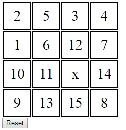

# Sliding Puzzle Game

This is a 16 piece puzzle game implemented in TypeScript/Next.js with Jest tests.

The game provides a 4 x 4 grid. The goal is to numerically order the pieces from 1 to 15, left to right, top to bottom.

```
1   2   3   4
5   6   7   8
9   10  11  12
13  14  15  X
```

Moves are made by shifting the blank space (`X`), which swaps it with an orthogonally adjacent piece. In other words, you can only move the X piece to the left, right, up, or down one space. In the example above, the X can only be swapped with the 12 or the 15.



## Running the Game

```
npm run dev
```

## Running the Unit Tests

```
npm test
```
